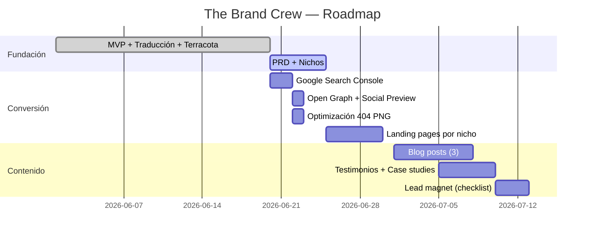

# The Brand Crew — Product Requirements Document

> **Versión**: 1.0  
> **Fecha**: 2026-06-20  
> **Estado**: Draft  
> **Autor**: Illya Grytsyk  

---

## 1. Product Vision

The Brand Crew es un estudio de diseño y desarrollo web boutique que construye **sitios web que realmente funcionan** para negocios que realmente importan. No hacemos páginas genéricas. Hacemos herramientas de crecimiento digital para **artesanos, crafters handmade, y escuelas neurodivergentes** — nichos que el mercado tradicional ignora porque "no escalan".

**Misión**: Democratizar el acceso a diseño web profesional para quienes hacen del mundo un lugar más hermoso.

---

## 2. Target Niches (Market Fit)

### 2.1 Artesanos & Handmade Crafters 🧵

| Aspecto | Detalle |
|---------|---------|
| **Perfil** | Carpinteros, ceramistas, textiles, cuero, velas, jabones. Venden en ferias, Instagram, Marketplace. |
| **Dolor** | No tienen presencia web propia. Dependen 100% de redes sociales. Sin control sobre su marca. |
| **Necesidad** | Catálogo online + WhatsApp + historias de producto (cómo se hizo). |
| **Propuesta** | "Tu taller merece más que un perfil de Instagram." |
| **Diferenciador** | Fotos del proceso real, materiales, historia del artesano. |

### 2.2 Escuelas Neurodivergentes 🧠

| Aspecto | Detalle |
|---------|---------|
| **Perfil** | Escuelas, centros, talleres para personas neurodivergentes (TEA, TDAH, dislexia, etc.). |
| **Dolor** | Sitios web confusos, mal diseñados, poco accesibles. Exactamente lo opuesto a lo que necesitan. |
| **Necesidad** | Navegación clara, lectura fácil, contraste alto, modos alternativos. |
| **Propuesta** | "Un sitio web que no les exija más de lo que pueden dar." |
| **Diferenciador** | Accesibilidad real (no checkbox compliance). Diseño neuro-inclusivo. |

---

## 3. Value Proposition Canvas

### Para artesanos:
- **Ganancia**: Presencia web profesional, clientes nuevos, control de marca.
- **Dolor eliminado**: No más depender de algoritmos de redes sociales.
- **Producto**: Landing page + catálogo + WhatsApp integration.

### Para escuelas neurodivergentes:
- **Ganancia**: Sitio accesible que sus alumnos y familias pueden usar sin frustración.
- **Dolor eliminado**: Sitios que confunden, distraen, o excluyen.
- **Producto**: Web accesible + modos visuales + contenido en lectura fácil.

---

## 4. Feature Requirements

### MVP (The Brand Crew actual)
- [x] Hero section con ilustración (peep)
- [x] Case studies (Luisito, Apolonia, Hoco)
- [x] Problem / Value proposition
- [x] Three steps (cómo funciona)
- [x] Pricing con break points
- [x] FAQ (3 preguntas)
- [x] Blog placeholder
- [x] About section
- [x] CTA / WhatsApp integration
- [x] Footer con branding
- [x] 404 page
- [x] Preloader animado
- [x] Accesibilidad base (skip-link, focus-visible, reduced-motion)
- [x] Scroll-reveal animations
- [x] robots.txt + sitemap.xml
- [x] i18n: Inglés

### V1.1 — Nichos
- [ ] Páginas de aterrizaje por nicho (`/artesanos`, `/escuelas`, `/handmade`)
- [ ] Testimonios de clientes reales
- [ ] Blog con artículos por nicho
- [ ] Gallery / portafolio visual
- [ ] Modo lectura fácil para escuelas
- [ ] WhatsApp pre-filled templates por nicho

### V1.2 — Conversión
- [ ] Open Graph tags (social preview)
- [ ] Google Search Console
- [ ] Analytics (Plausible / Fathom — privacidad primero)
- [ ] Lead magnet: checklist gratuito por nicho
- [ ] Newsletter / Mailchimp integration

---

## 5. Technical Architecture

### Stack
| Capa | Tecnología |
|------|-----------|
| Framework | HTML/CSS/JS vanilla (sin framework) |
| Design Tokens | OKLCH 3-Layer (tokens.css) |
| Hosting | Vercel |
| Domain | thebrandcrew.lat |
| Analytics | Plausible (privacy-first) |
| Icons | Lucide + Phosphor |

### Design System (Hardik Pandya 3-Layer)
```
Layer 1: Primitives   → tokens.css (--ds-gray-0, --ds-terracota...)
Layer 2: Semantics    → tokens.css (--color-text, --space-md...)
Layer 3: Components   → index.html (reference Layer 2 ONLY)
```

### Arquitectura de contenido
```
the-brand-crew/
├── index.html          # Landing page principal
├── 404.html            # Página 404 con ilustración
├── tokens.css          # Design system 3-layer
├── robots.txt          # SEO
├── sitemap.xml         # SEO
├── src/
│   └── preloader.js    # Preloader module
├── assets/
│   ├── peep-hero.svg   # Ilustración principal
│   ├── peep-blog.svg   # Ilustración blog
│   ├── error-404-image/ # Imagen 404 custom
│   └── logos/          # Logos clientes
├── site/
│   └── specs/          # Especificaciones de diseño
└── PRD.md              # Este documento
```

---

## 6. Design System

### Colors
```css
/* OKLCH — perceptually uniform */
--terracota:  oklch(0.58 0.18 32)    /* #DD614C — Primary */
--ochra:      oklch(0.72 0.12 75)    /* #C49032 — Secondary */
--verde:      oklch(0.82 0.2 125)    /* #7AB800 — Accent */
```

### Theme: Terracotta
```css
[data-theme="terracotta"] {
  --bg:         oklch(0.75 0.10 38)  /* Terracota claro */
  --headline:   oklch(0.0 0 0)       /* Negro */
  --body:       oklch(0.15 0.01 0)   /* Casi negro */
  --body-dim:   oklch(0.35 0.01 0)   /* Gris oscuro */
  --white:      oklch(0.95 0 0)      /* Blanco */
}
```

### Typography
| Uso | Font | Weight |
|-----|------|--------|
| Headings | Rethink Sans | 500-800 |
| Body | Rethink Sans | 300-400 |
| Accent | Grand Hotel | 400 (cursive) |
| Mono | JetBrains Mono | 400-700 |

### Componentes
- Glassmorphism cards (backdrop-filter blur + saturate)
- Botones con outline / solid variants
- Mobile-first responsive
- Scroll-reveal via IntersectionObserver

---

## 7. Content Strategy

### Tono de voz
- Cálido, directo, argentino (rioplatense)
- Profesional pero no corporativo
- "Somos un grupo de amigos profesionales que hace páginas web"

### Nicho Artesanos
```
Título: "Tu taller merece una vidriera digital"
Subtítulo: "No más depender del algoritmo de Instagram"
CTA: "Mostrame tu trabajo →"
```

### Nicho Escuelas Neurodivergentes
```
Título: "Un sitio web que no les exija más de lo que pueden dar"
Subtítulo: "Accesibilidad real, no checkbox compliance"
CTA: "Hablemos de tu escuela →"
```

### Blog Topics
- "Por qué los artesanos necesitan una web (y no solo Instagram)"
- "Diseño web neuro-inclusivo: guía práctica"
- "De la feria al e-commerce: el salto digital del artesano"
- "Accesibilidad web no es solo contraste de colores"

---

## 8. SEO & Discovery

### Técnico
- [x] robots.txt
- [x] sitemap.xml
- [ ] Google Search Console → **PENDIENTE**
- [ ] Open Graph tags → **PENDIENTE**
- [ ] Schema JSON-LD → **LISTO** (Organization + Offer)

### Palabras clave por nicho
| Nicho | Keywords |
|-------|----------|
| Artesanos | diseño web artesanos, página web para artesanos, tienda online artesanal |
| Handmade | web para emprendedores handmade, catálogo online crafters |
| Escuelas | diseño web accesible, accesibilidad web TEA, web para neurodivergentes |

---

## 9. Roadmap



---

## 10. Success Metrics

| Métrica | Objetivo | Instrumento |
|---------|----------|-------------|
| Google indexed pages | 3+ | Search Console |
| Organic traffic (mes 3) | 500+ visits | Plausible |
| WhatsApp clicks/mes | 20+ | Link tracking |
| Page load time | < 2s | Lighthouse |
| Accessibility score | 95+ | Lighthouse |
| CTA conversion rate | 3%+ | Analytics |
| Bounce rate | < 50% | Plausible |

---

## 11. Open Questions

1. ¿Precios en ARS o USD para el sitio en inglés?
2. ¿Blog propio o integración con Medium/Substack?
3. ¿Newsletter vía Mailchimp, Buttondown, o Beehiiv?
4. ¿Hosting de imágenes (Vercel Blob, Cloudinary, Imgix)?
5. ¿Analytics con Plausible autohosteado o Cloudflare?

---

## 12. Appendix

### A. Competencia indirecta
- Wix / Squarespace (genérico, sin nicho)
- Diseñadores freelance (sin sistema)
- Template farms (sin personalidad)

### B. Ventaja competitiva
- Especialización por nicho (no genérico)
- Accesibilidad real (no checkbox)
- Sistema de diseño OKLCH (mantenible a escala)
- Precios justos (no "presupuestos de otro planeta")
- Stack performance-first (100 Lighthouse)

---

*"Websites that actually work. For businesses that mean business."*
